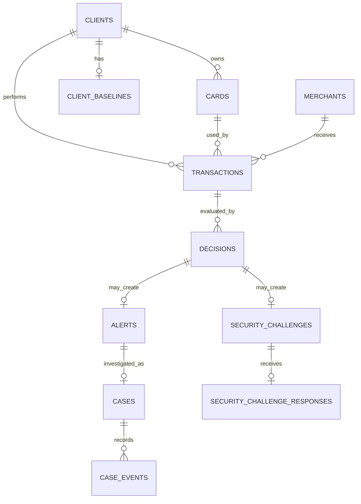

# Database Schema

Drizzle schemas live in `src/database/schemas`; SQL migrations in `drizzle/` run automatically at startup.

| Table                          | Purpose                              | Important constraints/indexes                                |
| ------------------------------ | ------------------------------------ | ------------------------------------------------------------ |
| `clients`                      | Customer profiles                    | PK; segment index                                            |
| `cards`                        | Cards and limits                     | PK; client FK/index                                          |
| `merchants`                    | MCC/category/city/risk               | PK; MCC index                                                |
| `transactions`                 | Immutable source stream              | PK; client/card/merchant/time indexes                        |
| `decisions`                    | Score/action/signals/version/latency | Unique transaction+version; 0–100 check; append-only trigger |
| `alerts`                       | Operator queue                       | Unique decision; status/client/risk indexes                  |
| `cases`                        | Investigation state                  | Unique alert; status/update index                            |
| `case_events`                  | Append-only timeline                 | Case/time index                                              |
| `security_challenges`          | Customer step-up                     | Unique decision; client/status/time index                    |
| `security_challenge_responses` | Device/customer result               | Unique challenge and idempotency key                         |
| `replay_jobs`                  | Replay progress/errors               | UUID/status                                                  |
| `client_baselines`             | Reserved persisted statistics        | Client PK/FK; runtime hydration pending                      |

Decision rows preserve signals, evidence, version, latency, and timestamp. The `decisions_append_only` trigger rejects `UPDATE` and `DELETE`; case changes create append-only events. Hidden datasets with overlapping IDs must run in a clean database.
